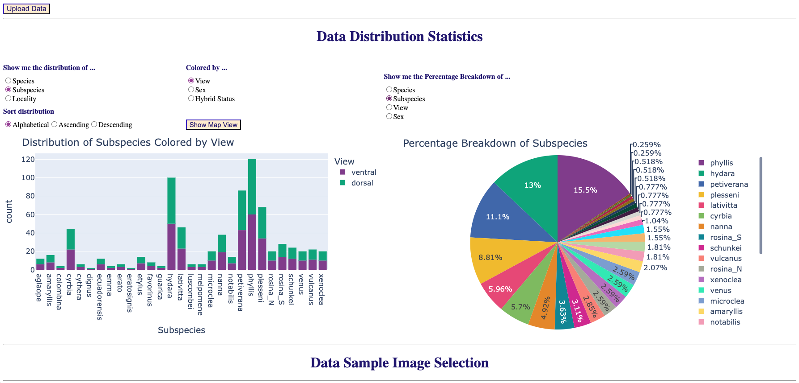
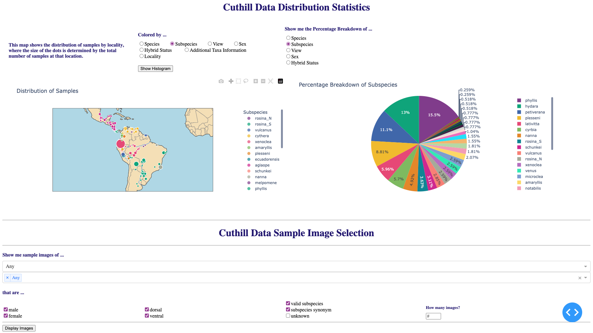

# Dashboard Prototype
Prototype data dashboard using the [Cuthill Gold Standard Dataset](https://huggingface.co/datasets/imageomics/Curated_GoldStandard_Hoyal_Cuthill), which was processed from Cuthill, et. al. (original dataset available at [doi:10.5061/dryad.2hp1978](https://doi.org/10.5061/dryad.2hp1978)). Test datasets (the processed version of Cuthill's data with and without filepath URLs) are available in [test_data](https://github.com/Imageomics/dashboard-prototype/tree/main/test_data).


### How it works

For full dashboard functionality, upload a CSV or XLS file with the following columns: 
- `Image_filename`: Filename of each image, must be unique. **Note:** These should be `png` or `jpg`, `tif` may not show image.
- `Species`: Species of each sample.
- `Subspecies`: Subspecies of each sample.
- `View`: View of the sample (eg., 'ventral' or 'dorsal' for butterflies).
- `Sex`: Sex of each sample.
- `hybrid_stat`: Hybrid status of each sample (eg., 'valid_subspecies', 'subspecies_synonym', or 'unknown').
- `lat`: Latitude at which image was taken or specimen was collected.
- `lon`: Longitude at which image was taken or specimen was collected.
- `file_url`: URL to access file.

**Note:** `lat` and `lon` columns are not required to utilize the dashboard, but there will be no map view if they are not included.

### Running Dashboard

Create and activate a new (python) virtual environment. 
Then install the required packages (if using `conda`, first run `conda install pip`):

``` 
pip install -r requirements.txt 
```

and run 

```
python dashboard.py
```

Then navigate to [http://127.0.0.1:8050/](http://127.0.0.1:8050/) in your browser to see the graphs.


### Preview

#### Histogram View


#### Map View



### Running Tests

Within your python environment run the following command to run the tests:
```
python -m unittest
```
