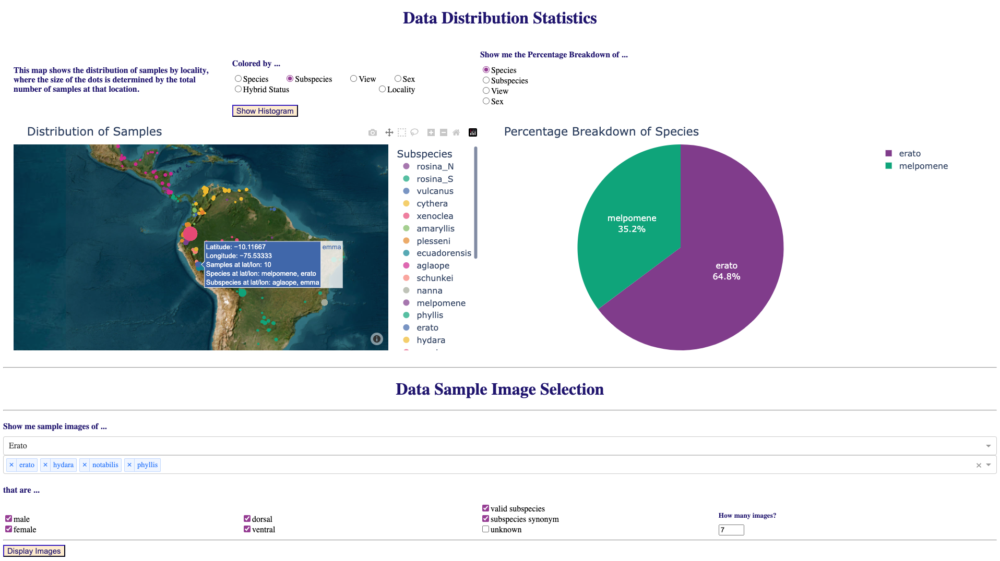

# Dashboard Prototype
Prototype data dashboard using the [Cuthill Gold Standard Dataset](https://huggingface.co/datasets/imageomics/Curated_GoldStandard_Hoyal_Cuthill), which was processed from Cuthill, et. al. (original dataset available at [doi:10.5061/dryad.2hp1978](https://doi.org/10.5061/dryad.2hp1978)). Test datasets (the processed version of Cuthill's data with and without filepath URLs) are available in [test_data](./test_data).


## How it works

For full dashboard functionality, upload a CSV or XLS file with the following columns: 
- `Image_filename`*: Filename of each image, must be unique. **Note:** Images should be in PNG or JPEG format, TIFF may fail to render in the sample image display.
- `Species`: Species of each sample.
- `Subspecies`: Subspecies of each sample.
- `View`: View of the sample (eg., 'ventral' or 'dorsal' for butterflies).
- `Sex`: Sex of each sample.
- `hybrid_stat`: Hybrid status of each sample (eg., 'valid_subspecies', 'subspecies_synonym', or 'unknown').
- `lat`*: Latitude at which image was taken or specimen was collected: number in [-90,90].
- `lon`*:  Longitude at which image was taken or specimen was collected: number in [-180,180]. `long` will also be accepted.
- `file_url`*: URL to access file.

***Note:** 
- Column names are **not** case-sensitive.
- `lat` and `lon` columns are not required to utilize the dashboard, but there will be no map view if they are not included. Blank (or null) entries are recorded as `unknown`, and thus excluded from map view.
- `Image_filename` and `file_url` are not required, but there will be no sample images option if either one is not included.
- `locality` may be provided, otherwise it will take on the value `lat|lon` or `unknown` if these are not provided.

## Running Dashboard

Create and activate a new (python) virtual environment. 
Then install the required packages (if using `conda`, first run `conda install pip`):

``` 
pip install -r requirements.txt 
```

and run 

```
python dashboard.py
```

Then navigate to [http://127.0.0.1:8050/](http://127.0.0.1:8050/) in your browser to see the graphs.

## Running with Docker
To run the dashboard in a more scalable manner a Dockerfile is provided.
This container uses [gunicorn](https://gunicorn.org/) to support more users at the same time.
Building and running the container requires that [docker](https://www.docker.com/) is installed.

### Building the container
```
docker build -t dashboard .
```

### Running the container
To deploy the dashboard with 6 workers run the following command:
```
docker run --env BACKEND_WORKERS=6 -p 5000:5000 -it dashboard
```
Then open the following URL <http://0.0.0.0:5000/>.


## Preview

### Histogram View


### Map View



## Testing

### Test Requirements
The testing suite requires [Dash Testing](https://dash.plotly.com/testing) and [pytest-mock](https://pypi.org/project/pytest-mock/), which can be installed in your python environment by running:
```
pip install dash\[testing] pytest-mock
```

### Running Tests

Within your python environment run the following command to run all tests:
```
pytest
```
